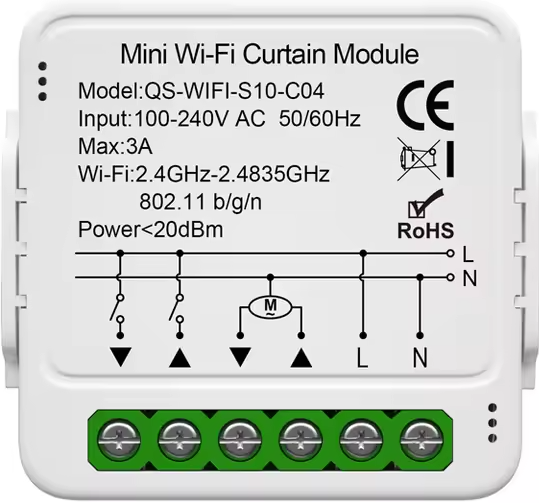
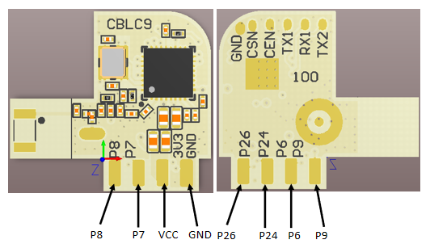
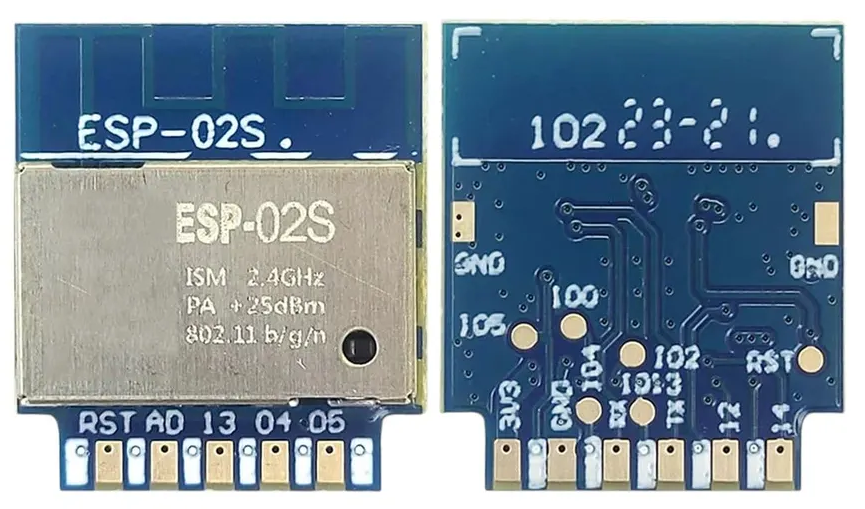

# Avvolgibili (shutter-curtain-blind)

#### Modulo MiniCurtain   Mini WIFI Curtain Module QS-WIFI-S10-C4 (Tuya)

Il modulo acquistato usa un modulo **CBLC9**, al cui interno si trova un chip BK7231N programmato per il mondo *Tuya*.
Dopo un primo tentativo, funzionante, con [OpenBeken](https://www.elektroda.com/rtvforum/topic4049271.html) è stato più arduo (impossibile?) integrarlo in *Home Assistant* come tapparella, per il motivo di come veniva esposto il device su MQTT dal firmware. I dispositivi per comando tapparelle dotati di Tasmota, vengono presentati in MQTT (o per ESPHome) come dispositivo unico con diverse entità (switch e ralay) incorporate. OpenBeken presenta ogni singolo switch separatamente.

Dopo una prima idea di intervenire sul software cercando di andare a capire il funzionamento del protocollo MQTT, mi sono reso conto che era fuori dalla mia portata.
Alla fine ho optato per una modifica hardware sostituendo il modulo *CBLC9* con un *ESP-02S* e programmazione di quest'ultimo con Tasmota.

Questo ha comportato l'apertura dello scatolino e la <u>dissaldatura</u> del modulo originale.
Poi, oviamente, sulle piazzole del PCB sono stati saldati gli otto fili necessari e <u>riportati fuori dalla scatola</u> per poter essere connessi al <u>modulo ESP-02S posto esternamente</u>.

Sul modulo CBCL9 abbiamoi i seguenti piedini (con relative funzioni):

| Nome | Funzione | Colore assegn.|
| - | - | - |
| P8 | LED | $\color{#ff7900}{\text{Arancio}}$ |
| P7 | Relay DOWN| $\color{brown}{\text{Marrone}}$ |
| VCC | 3.3V | $\color{red}{\text{Rosso}}$ |
| GND | GND | Nero |
|| Altro lato||
| P9 | Relay UP | $\color{blue}{\text{Blu}}$ |
| P6 | Switch esterno SU | $\color{purple}{\text{Viola}}$ |
| P24 | Switch interno | $\color{green}{\text{Verde}}$ |
| P26 | Switch Esterno GIU | $\color{#ffcc00}{\textsf{GialloHex text}}$ |

Prima di saldare l'**ESP-02S** ai vari cavi è stato caricato su quest'ultimo il firmware Tasmota ultima versione.

La connessione dei cavi su ESP ha seguito combinazione
| Pin | Colore |
| - | - |
| RST | -- NC --|
| A0 | -- NC --|
| 13 | $\color{blue}{\text{Blu}}$ |
| 04 | $\color{#ffcc00}{\textsf{GialloHex text}}$ | 
| 05 | $\color{green}{\text{Verde}}$ |
| Altro lato |
| 14 | $\color{purple}{\text{Viola}}$ |
| 12 | $\color{brown}{\text{Marrone}}$ |
| TX | $\color{#ff7900}{\text{Arancio}}$ |
| RX | -- NC --|
| GND | Nero |
| VCC | $\color{red}{\text{Rosso}}$ |

