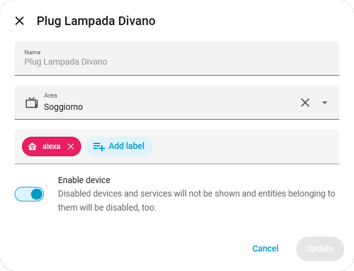

# Alexa e HA insieme con Matter
## Integrazione con HAMH

*Si da per scontato che si possegga un dispositivo Amazon della famiglia Alexa con relativo account associato al dispositivo, uno smartphone con l'app "Amazon Alexa" installata*

**H**ome **A**ssistant **M**atter Bridge (HAMH) quale BRIDGE/Gateway Matter, permette di esporre le entità di Home Assistant verso Alexa (o altri sistemi Matter-compatibili).  
*HAMH <u>NON</u> funziona su dispostivi Echo di prima generazione ed alcuni modelli meno recenti.*

Per prima cosa è necessario metter mano HAMH, una volta installato in HA al suo avvio sarà vuoto e pronto per configurare uno o più bridge Matter.
Per istanziare tale software, le guide variano in base al proprio contesto operativo:
- come add-on presso Home Assistant OS;
- come container Docker@Linux Debian presso Mini PC e similari, per Home Assistant Core;
- come container Docker@OpenMediaVault presso NAS e similari, per Home Assistant Core;
- come container Docker@Raspberry Pi OS presso Raspberry Pi e similari, per Home Assistant Core.

Qui riporto la mia configurazione che si basa su una Virtual Machine e quindi add-on di Home Assistant OS.

### Etichette (ovvvero “label”)
Per esporre le entità di Home Assistant ad Alexa in pratica è possibile assegnare una parola chiave alle entità da esporre al bridge (e quindi ad Alexa).

Ci sono sostanzialmente due strade, in questo senso:

- creare sotto HAMH un unico bridge Matter da esporre ad Alexa, al quale “passare” tutte le entità di interesse;
- creare diversi bridge Matter, per tipologia di entità.

Per esempio:
 
- un’unica etichetta "**alexa**" da assegnare a tutte le entità di interesse;
- un’entità "**alexa_luci**" per le entità **light.\***, una "**alexa_interruttori**" per le entità **switch.\*** e così via.

Nella pratica ho visto che nella mia situazione di domotica non c'è una reale esigenza di spezzettare le entità, quindi ho creato un'etichetta unica per tutti i devices, con *molta fantasia* chiamata "**alexa**", da esporre.

<u>ATTENZIONE</u>: nel creare le label, non usare caratteri speciali o maiuscoli.
#### Battezzare le entità
Andiamo ala scheda di dettaglio dell’entità desiderata, scegliamo la matita per "*edit settings*"  e, alla scheda aperta scegliamo '+add label' e scriviamo la nostra etichetta “**alexa**“ (senza virgolette):

</img> 
*immagine di esempio su una lampada*

Quindi secgliamo **Update** per confermare. 
Ripetiamo l'operazione di atichettatura per tutte le entità di interesse. Al termine, saremo pronti per definire un nuovo bridge con HAMH.
> ATTENZIONE: non necessariamente tutte le entità di Home Assistant, sebbene magari supportate da Alexa, sono effettivamente esponibili tramite Matter. Per maggiori info, consultare la [la documentazione di HAMH](https://t0bst4r.github.io/home-assistant-matter-hub/supported-device-types). **N.b.** Provvedere ad etichettare come sopra spiegato almeno una entità. *Non superare le 50 entità*, come consiglio di base.

### Configurare il bridge su HAMH
Andare ora presso l’interfaccia web di HAMH (sulla barra laterale sinistra in caso di Home Assistant OS, oppure alla porta 8482, via http, all’indirizzo IP dell’host ospitante HAMH, ad esempio http://192.168.1.100:**8482**)

Cliccare su “**Create a new bridge**“:

quindi compilare come segue:

- <u>Name</u>: inserire “**alexa_hamh**” (oppure un nome a piacere);
- <u>Port</u>: lasciare quella di *default* (solitamente la **5540**);
- <u>Country code</>: **IT**

poi cliccare sul “**+**” nella sezione “**Include**“:

- selezionare, come <u>Type</u>, “**label**“
- <u>value</u>, indicare “**alexa**“

e infine recarsi in fondo alla pagina e cliccare su “**Save**“.
<!--- ------------------------------------
continuare:
https://indomus.it/guide/integrare-home-assistant-ad-amazon-alexa-via-matter-con-hamh/
------------------------------------- --->
